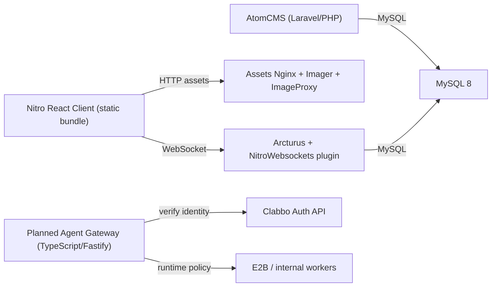

# Clabbo Exploration Report (February 25, 2026)

## Why this report exists

You asked for a full exploration pass before a new maximalist implementation plan. This report captures:

- what this repo currently is,
- what has already been patched,
- what is still broken or risky (netcode/chat/actions/security/deploy),
- and the hard platform constraints we must design around for Vercel deployment.

## System map (current state)

## What is already improved

- `nitro/Dockerfile` now supports patch application and reproducible dependency install.
- Netcode hardening patch already exists in `nitro/patches/0001-netcode-reconnect-and-buffer-hardening.patch`.
- Reconnect config keys are now present in `nitro/example-renderer-config.json`.
- Backup env bug in `compose.yaml` was corrected (`DB01_NAME` now points to `$MYSQL_DATABASE`).
- External-agent onboarding docs and unified skill exist:
  - `docs/agents/e2b-vs-alternatives.md`
  - `docs/agents/clabo-secure-connection-contract.md`
  - `skills/clabo-external-agent-connector/SKILL.md`

## High-impact issues still present

### 1) Chat logic correctness bugs

- Wrong localization key (extra semicolon) in pet re-fertilize message:
  - `vendor/nitro/apps/frontend/src/hooks/rooms/widgets/useChatWidget.ts:181`
- Wrong user lookup target for pet-related message context:
  - currently reads `roomObject.id` instead of the target object context at:
  - `vendor/nitro/apps/frontend/src/hooks/rooms/widgets/useChatWidget.ts:191`

Impact: incorrect/missing localized system chat strings and wrong actor name resolution in room chat events.

### 2) Chat rendering/performance mutation anti-patterns

`setChatMessages` callbacks mutate existing arrays/objects and return original references in multiple places:

- `vendor/nitro/apps/frontend/src/components/room/widgets/chat/ChatWidgetView.tsx:63`
- `vendor/nitro/apps/frontend/src/components/room/widgets/chat/ChatWidgetView.tsx:89`
- `vendor/nitro/apps/frontend/src/components/room/widgets/chat/ChatWidgetView.tsx:109`

Impact: non-deterministic rerenders, janky chat motion on busy rooms, and harder debugging under load.

### 3) Event registration churn risk

- `vendor/nitro/apps/frontend/src/hooks/events/useMessageEvent.tsx:6`

The hook depends on `handler` identity directly. Many call sites pass inline callbacks, causing frequent unregister/re-register cycles.

Impact: extra GC pressure and event churn during high-frequency render paths.

### 4) Cross-window bridge security exposure

- Incoming postMessage accepts any origin:
  - `vendor/nitro/libs/renderer/src/nitro/externalInterface/LegacyExternalInterface.ts:39`
- Outgoing postMessage uses wildcard target `"*"`:
  - `vendor/nitro/libs/renderer/src/nitro/externalInterface/LegacyExternalInterface.ts:68`
  - `vendor/nitro/libs/renderer/src/nitro/externalInterface/LegacyExternalInterface.ts:90`

Impact: expanded cross-origin attack surface for legacy bridge callbacks.

### 5) Reconnect lifecycle still incomplete for strict protocol gating

- `_isReady` is set once and not explicitly reset on new socket init:
  - `vendor/nitro/libs/renderer/src/core/communication/SocketConnection.ts:80`
  - `vendor/nitro/libs/renderer/src/core/communication/SocketConnection.ts:93`

Impact: risk of state drift across reconnect cycles when handshake/auth sequencing changes.

### 6) Agent gateway scaffold is incomplete

- Compile error from Redis typing:
  - `services/agent-gateway/src/stores/redisStores.ts:8`
  - `services/agent-gateway/src/stores/redisStores.ts:20`
- No `src/server.ts` bootstrap yet (service cannot run end-to-end).

Impact: identity/session policy work is drafted but not deployable.

## Vercel deployment reality (hard constraints)

1. This repo is not a single deployable Vercel app today. It is a multi-service stack:
- Java emulator,
- MySQL,
- PHP CMS,
- Nginx assets/imager services,
- static Nitro frontend.

2. Vercel Functions are not a WebSocket host for this game server model.
- Vercel’s own guide explicitly states they do **not** support acting as a WebSocket server.
- This means Arcturus websocket (port 2096) must stay on persistent infra.

3. Therefore the correct architecture is split-plane:
- **Vercel:** control plane (gateway/API/static Nitro hosting/observability hooks),
- **Persistent compute:** game websocket/data plane (Arcturus + DB-adjacent services).

## Clabbo Auth-inspired adaptation direction

Clabbo Auth should be used for identity and trust establishment, not copied blindly. For Clabbo we need:

- workspace-scoped capability tokens that map to game-domain actions (`room.chat.send`, `room.mod.kick`, `room.furni.place`, etc.),
- runtime policy routing (`e2b` for external/untrusted, internal worker for trusted automation),
- session lifecycle + replay protection + full audit trail,
- action adapters that understand Habbo-like room/session semantics.

## Source references used (verified Feb 25, 2026)

- [Vercel WebSockets Guide](https://vercel.com/guides/do-vercel-serverless-functions-support-websocket-connections) (states Functions do not host WebSocket servers)
- [Vercel Node.js Runtime Docs](https://vercel.com/docs/functions/runtimes/node-js)
- [Vercel Functions Production Checklist](https://vercel.com/docs/functions/production-checklist)
- [Vercel Fluid Compute Docs](https://vercel.com/docs/functions/fluid-compute)
- [E2B Docs](https://e2b.dev/docs)
- [Clabbo Auth Developers Docs](https://www.clabbo-auth.com/developers.md)

